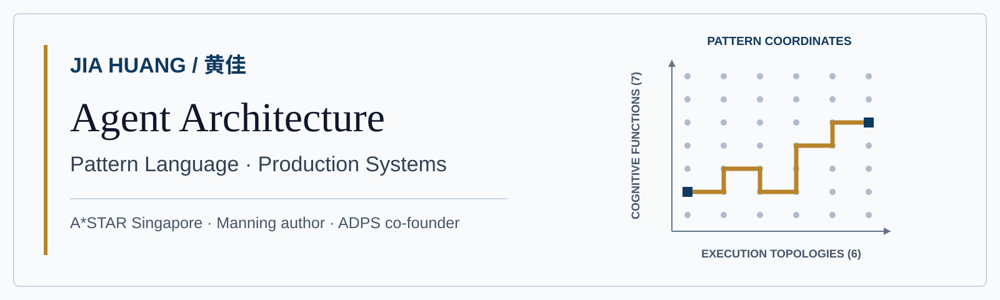
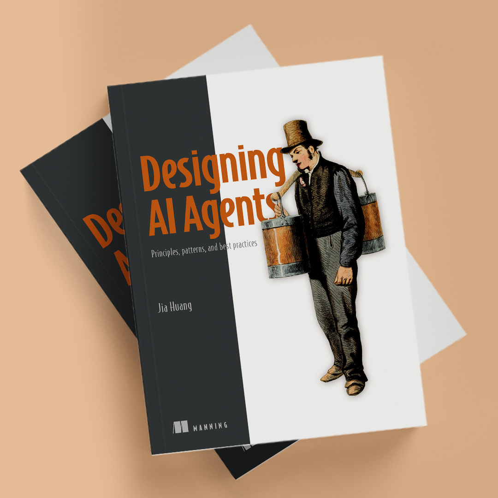
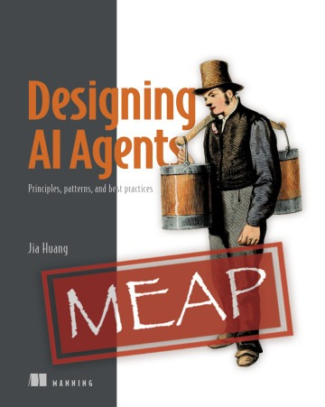
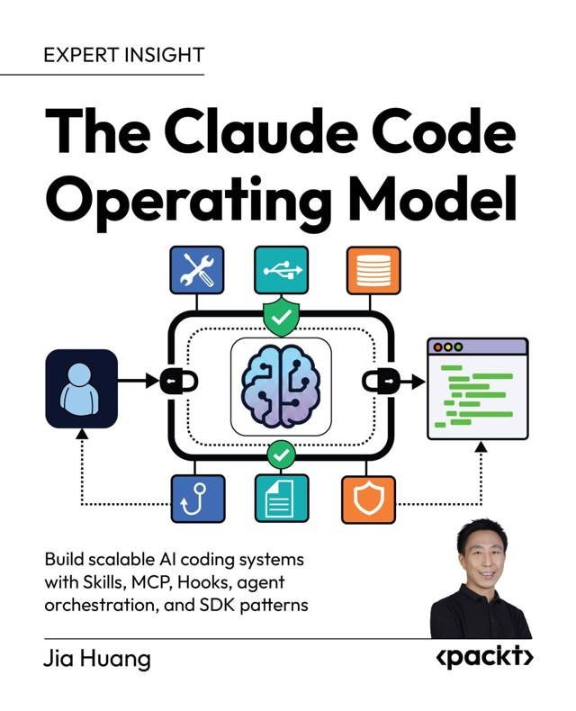
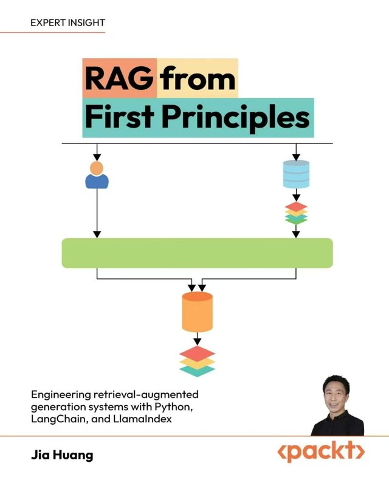
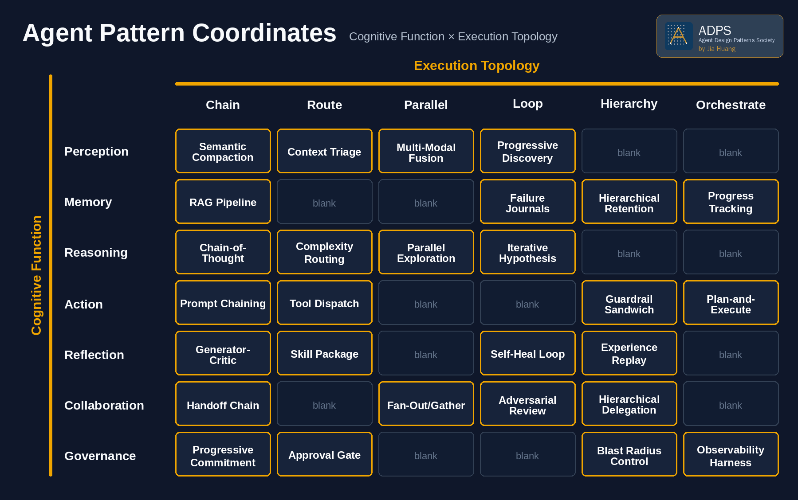

  

# Jia Huang (黄佳)

AI researcher at A*STAR Singapore, author of [*Designing AI Agents*](https://www.manning.com/books/designing-ai-agents) (Manning), [*The Claude Code Operating Model*](https://www.amazon.com/dp/B0H947QRWW) and [*RAG from First Principles*](https://www.amazon.com/dp/B0H2D9T84S) (Packt), and co-founder of the [Agent Design Patterns Society](https://adpsagent.com/).

I work on agent architecture, design patterns, long-running reliability, and the controls that make agentic systems usable in real organizations. Before moving into AI research, I spent more than a decade working on multinational enterprise systems.

[Amazon Author Page](https://www.amazon.com/stores/author/B0H533BWNJ) · [Website](https://kage-ai.com/) · [Professional profile (PDF)](https://kage-ai.com/files/Jia-Huang-Profile.pdf) · [Substack](https://agentpatterns.substack.com/) · [ADPS](https://adpsagent.com/) · [LinkedIn](https://www.linkedin.com/in/jia-huang-74657145/) · [中文主页](https://kage-ai.com/zh/)

## Current work

- **Agent architecture:** a two-axis framework combining seven cognitive functions with six execution topologies.
- **Governance in practice:** approval gates, blast-radius control, observability, and progressive autonomy.
- **Long-running agents:** progress tracking, checkpoints, failure journals, and recovery from goal drift.
- **Engineering education:** books, columns, and courses that have reached more than 100,000 engineers on Geek Time.

The forthcoming Manning book [*Designing AI Agents*](https://www.manning.com/books/designing-ai-agents) develops these ideas as a practical catalogue of principles, patterns, and engineering trade-offs.

 

## Books

<table>
  <tr>
    <td align="center" width="33%">
      
    </td>
    <td align="center" width="33%">
      
    </td>
    <td align="center" width="33%">
      
    </td>
  </tr>
  <tr>
    <td align="center"><b><a href="https://www.manning.com/books/designing-ai-agents">Designing AI Agents</a></b> Manning · MEAP</td>
    <td align="center"><b><a href="https://www.amazon.com/dp/B0H947QRWW">The Claude Code Operating Model</a></b> Packt</td>
    <td align="center"><b><a href="https://www.amazon.com/dp/B0H2D9T84S">RAG from First Principles</a></b> Packt</td>
  </tr>
  <tr>
    <td align="center">A catalogue of agent design patterns, organized by cognitive function and execution topology.</td>
    <td align="center">Claude Code as an engineering platform: Skills, MCP, Hooks, sub-agent orchestration, and SDK patterns.</td>
    <td align="center">Retrieval-augmented generation built up from first principles with Python, LangChain, and LlamaIndex.</td>
  </tr>
</table>

Editions, formats, and new releases are listed on my [Amazon Author Page](https://www.amazon.com/stores/author/B0H533BWNJ).

## The framework

The coordinate system separates what an agent is doing from how the work is executed. The public catalogue maps reusable patterns across seven cognitive functions and six execution topologies.

## Start here

- [Agent Design Patterns](https://github.com/huangjia2019/agent-design-patterns) — the 7×6 framework, pattern catalogue, and runnable examples.
- [Designing AI Agents](https://github.com/huangjia2019/designing-ai-agents) — companion code for the Manning book.
- [Claude Code Engineering](https://github.com/huangjia2019/claude-code-engineering) — engineering practices and runnable teaching examples, alongside [*The Claude Code Operating Model*](https://www.amazon.com/dp/B0H947QRWW).
- [RAG in Action](https://github.com/huangjia2019/rag-in-action) — retrieval-system design, evaluation, and optimization, alongside [*RAG from First Principles*](https://www.amazon.com/dp/B0H2D9T84S).
- [A Two-Axis Framework for Designing AI Agents](https://arxiv.org/abs/2605.13850) — the research paper behind the framework.

## Writing

I publish shorter essays on [Substack](https://agentpatterns.substack.com/) and longer reference material at [kage-ai.com](https://kage-ai.com/). The bilingual ADPS whitepapers and pattern catalogue live at [adpsagent.com](https://adpsagent.com/).
